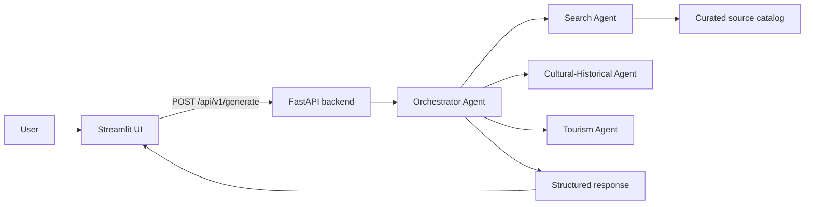

# Bac Bling AI Agent

Source-aware Bac Ninh tourism and cultural exploration MVP. The app helps users create structured itineraries, check-in recommendations, historical-cultural narratives, and reviewer-friendly source summaries.

## Status

MVP source updated to match `specs/product-spec.md` version `0.3.0`.

## Stack

| Layer | Technology |
|-------|------------|
| UI | Streamlit |
| API | FastAPI + OpenAPI |
| Agent orchestration | Four logical agents in `backend/agent.py` |
| Sources | Built-in curated source catalog with verification warnings |
| Guidance | `skills/travel-consultant/SKILL.md` |

## Architecture



## Getting Started

1. Create and activate a Python virtual environment.
2. Install dependencies:
   `pip install -r requirements.txt`
3. Copy `.env.example` to `.env` and adjust values if needed.
4. Start the API:
   `uvicorn backend.main:app --reload --host 0.0.0.0 --port 8000`
5. Start the UI:
   `streamlit run frontend/app.py`
6. Open the Streamlit URL and ask about Bac Ninh routes, Quan ho, craft villages, check-in spots, sources, or industrial-zone route warnings.

## API

- `GET /health`
- `POST /api/v1/generate`
- `POST /api/v1/source-summary`
- `POST /api/v1/tour`
- `POST /api/v1/chat` compatibility alias for generate
- `POST /api/v1/tts` legacy local TTS endpoint
- OpenAPI docs: `/docs`

`POST /api/v1/generate` accepts:

```json
{
  "message": "Create a 1-day Bac Ninh tour themed around Quan ho and craft villages",
  "output_type": "tour_itinerary",
  "source_mode": "strict",
  "conversation_id": "optional-uuid"
}
```

The response includes `reply`, `output_type`, `intent`, `confidence`, `sources`, `warnings`, `agent_trace`, and `conversation_id`.

## Testing

Run:

`pytest -q`

The automated tests cover health metadata, generate/chat contracts, source summaries, tour output, and sensitive historical claim handling.

## Scope Limits

The MVP does not include booking, payments, user accounts, live maps, guaranteed real-time weather, live opening hours, or confirmed industrial-zone access. Operational details are returned with verification warnings unless a reliable current source is available.
