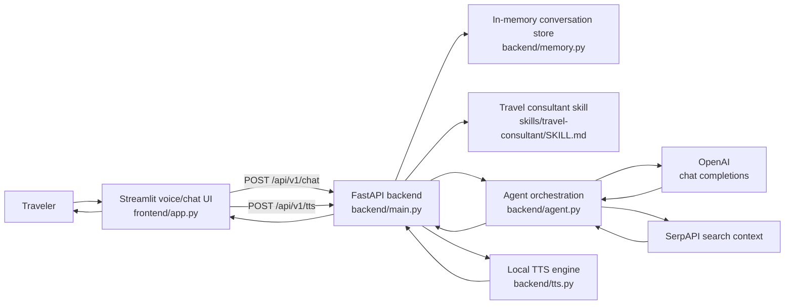

# Voice Travel Agent AI

A voice-first travel agent MVP powered by **OpenAI**. Users can speak or type in a **Streamlit** UI; a **FastAPI** backend exposes an OpenAPI-documented API and runs the agent logic. A **travel consultant skill** defines how the agent recommends destinations, hotels, weather, and food, and the backend can enrich answers with **SerpAPI** search context and now generates spoken replies through a local backend TTS endpoint.

## Status

**MVP scaffold implemented** — backend, frontend, skill file, and baseline tests are present.

## Stack

| Layer | Technology |
|-------|------------|
| UI | Streamlit (Python) |
| API | FastAPI + OpenAPI |
| Agent | OpenAI chat completions |
| Retrieval | SerpAPI search context for destination/hotel/weather/food enrichment |
| TTS | Local backend TTS (`pyttsx3`) returning `audio/wav` — configurable via `TTS_ENGINE` |
| Guidance | Travel consultant skill file (`skills/travel-consultant/SKILL.md`) |

## Architecture



## Project layout

```
travel-advisor/
├── README.md
├── AGENTS.md
├── .env.example
├── requirements.txt
├── specs/
├── skills/travel-consultant/SKILL.md
├── backend/
├── frontend/
└── tests/
```

## Prerequisites

- Python 3.11+
- OpenAI API access
- SerpAPI credentials if you want destination/hotel/weather/food enrichment
- Platform TTS support for `pyttsx3` (Windows Speech API, macOS `nsss`, Linux `espeak`)

## Getting started

1. Create and activate a Python virtual environment.
2. Install dependencies:
   - `pip install -r requirements.txt`
3. Copy `.env.example` to `.env` and set `OPENAI_API_KEY`, optional `OPENAI_MODEL`, SerpAPI, and TTS variables.
4. Start API:
   - `uvicorn backend.main:app --reload --host 0.0.0.0 --port 8000`
5. Start UI:
   - `streamlit run frontend/app.py`
6. Open the Streamlit URL and ask for trip advice.

## API

- Health check: `GET /health`
- Chat endpoint: `POST /api/v1/chat`
- TTS endpoint: `POST /api/v1/tts`
- Docs: `/docs`

## Testing

- Run: `pytest`

## Documentation

| File | Purpose |
| ------ | --------- |
| [AGENTS.md](AGENTS.md) | How AI agents should work in this repo |
| [specs/product-spec.md](specs/product-spec.md) | What we are building |
| [specs/implementation-plan.md](specs/implementation-plan.md) | How we build it |
| [specs/test-plan.md](specs/test-plan.md) | How we verify it |
| [specs/change-log.md](specs/change-log.md) | Spec and product changes |
